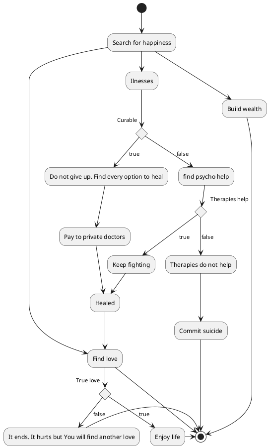

# Just life
Sometimes we are thinking about our life. What makes us happy, what we want. It is kind of fun creates this as a state diagram.
 - Health?
 - Lot of money? 
 - Wonderful appartment? 
 - Lot of friends? 
 - Love?
 - Be famous artist?
 
There can be things that will undermine a person's path such as illness, break with the love of life, what is your case? Will you fight till the end?

Will you enjoy life to the fullest? Or are you colorblind and all people tell you how colorful the world is?

