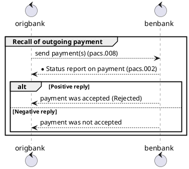
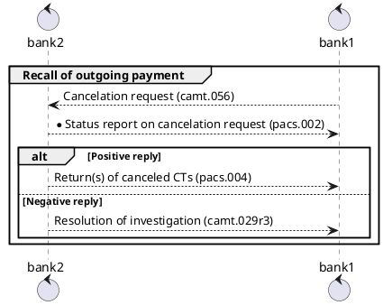

# anet_portfolio

# Digital banking system - SEPA payments
ISO 20022, the International Organisation for Standardisation, have used XML as the international standard format for their payment messages.

- [SEPA Credti Transfer rule book](https://www.europeanpaymentscouncil.eu/sites/default/files/kb/file/2018-03/EPC005-18%20SCT%20Rulebook%202018%20Change%20Request%20Public%20Consultation%20Document.pdf)

- [SEPA CREDIT TRANSFER SCHEME
INTERBANK
IMPLEMENTATION GUIDELINES](https://www.europeanpaymentscouncil.eu/sites/default/files/kb/file/2018-11/EPC115-06%20SCT%20Interbank%20IG%202019%20V1.0.pdf)

# Terminology of files that are used for communication between originator and beneficiary

|Term|Description|
|--|---|
|PACS.008|payment(s) send from originator to beneficiary bank in XML file.|
|PACS.002|Status report - can be positive or negative (RJCT or ACCP) in XML file. Sends beneficiary bank to originator in XML file. This status report is in pre-settlement phase.|
|PACS.004|Form of a return the payment (return based on un-processable PACS.008 payment). Sends beneficiary bank to originator in XML file. Also use for accpetation of recalls.|
|CAMT.056| Recall in XML file.|
|CAMT.029|Negative answers to incoming recalls|
|CAMT.027|Claim non-receipt. SCT Inquiry. This message is sent by originator (originator bank), in case that beneficiary has not received a payment.|
|CAMT.087|Claim for value date correction.|

# High-level visualization of payment messages

Origbank - bank of the originator, Benbank - bank of the beneficiary

[Sequence diagram](http://plantuml.com/sequence-diagram)

1. Originator sends payment in pacs.008 XML file
2. If XML file is correct/structured as should be/have all mandatory elements then is accepted by the beneficiary bank
3. Beneficiary bank can accept this payment and send status report (response) as pacs.002 with ACCEPTED code
4. Beneficiary bank can not accept this payment and send a status report (response) as pacs.002 with REJECTED code

# Recall process in digitan banking system SEPA only (between two banks (bank1 and bank2))

